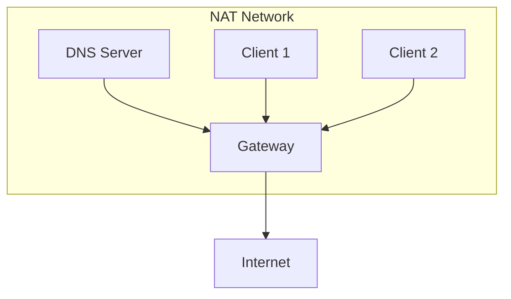
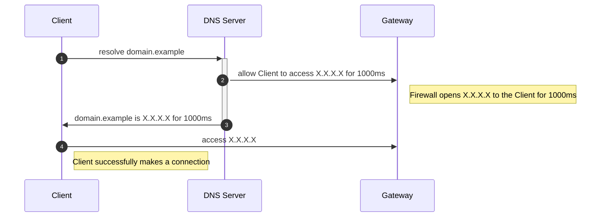
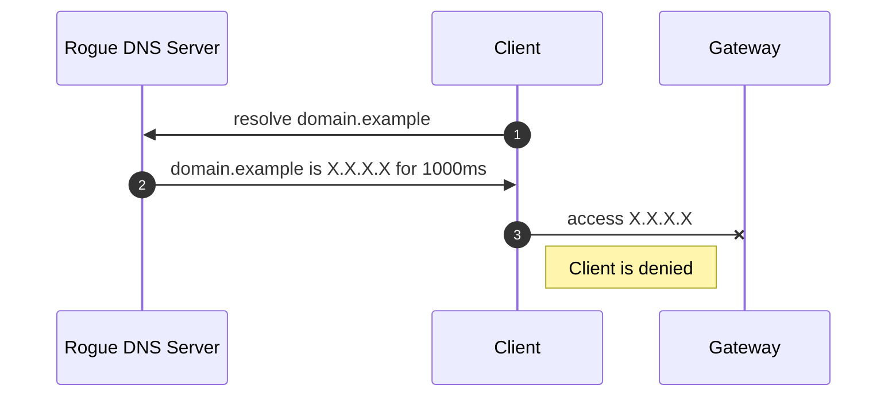
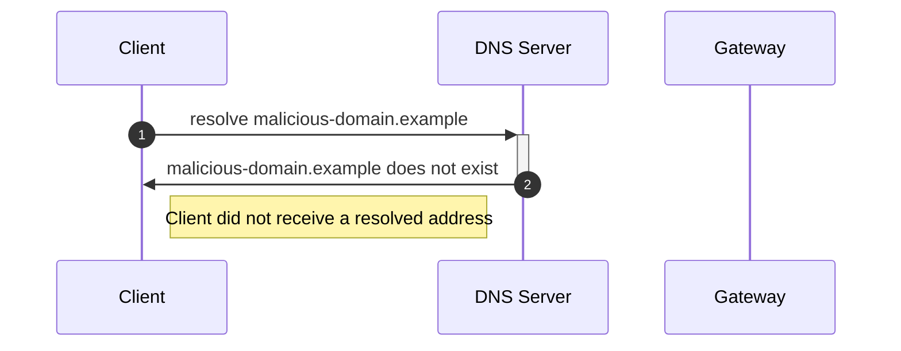

# DNS Firewall Controller

## Background

Suppose we have a simple NAT network with a few devices connected to a gateway that provides access to the broader internet.
For simplicity, let us imagine the DNS server as a device on that network.
All clients connected to the network are expected to use the DNS server.

This topology is similar to that of most home networks, except that the router often includes its own DNS server.
Here you could imagine clients to be computers, IoT devices, phones, or any other networked consumer device.

### Benefits

Networks with a controlled DNS server have a few benefits:

1. Through a technique called a **DNS Sinkhole**, DNS servers can choose to block certain domains.
   Authoritative block-lists or even allow-lists can be used to prevent users from accessing malicious domains, or domains that are blocked for policy reasons.
1. DNS servers can be configured to keep logs of client connections, which could be important for security or compliance reasons.
1. DNS servers can be configured with additional security measures, such as DNSSEC.

### Drawbacks

The main drawback of this model is that devices connected to the network are under no obligation to honor the DNS server assigned to them via DHCP.
Firewalls can be used to block other DNS traffic, but there is nothing stopping a malicious client from resolving blocked domains via a side channel DNS server, such as through DNS over HTTPS.
Attackers could also sidestep the problem of DNS resolution completely using hardcoded IP addresses.

## Solution

One solution to this problem is to force clients of a network to announce their intention to connect to an address through the DNS server before giving them any permissions to access external addresses.
Honest clients respecting the network's preferred DNS server will be unaffected.

### Honest Client Makes a Successful Connection

### Malicious Client Attempts to use a Rogue DNS Server

If a **client** resolves an address through a rogue DNS server or side channel, they will still be denied by the **gateway** because the **preferred DNS server** did not report the request.

### Honest Client Attempts to Resolve a Block-listed Domain

